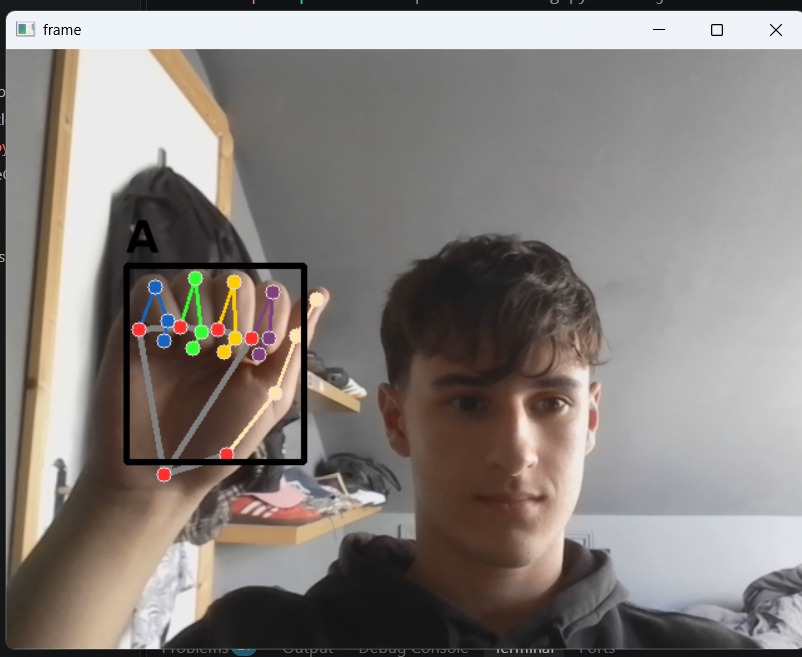

# Sign Language Interpreter

Real-time interpreter that classifies hand signs (**A**, **B**, **L**) from a webcam feed using MediaPipe hand landmarks and a Random Forest classifier.

## Pipeline

1. `collectInputs.py` — collects webcam images for each sign class
2. `dataset.py` — extracts hand landmarks with MediaPipe, saves to `data.pickle`
3. `trainClassifier.py` — trains a Random Forest classifier, saves `model.p`
4. `inferenceClassifier.py` — runs live predictions from the webcam

## Requirements

- Python 3.12 (MediaPipe doesn't yet support 3.13+)
- `pip install opencv-python mediapipe==0.10.14 scikit-learn numpy matplotlib`

## Usage

```bash
python collectInputs.py
python dataset.py
python trainClassifier.py
python inferenceClassifier.py
```

Press `Q` in the camera window to start capturing each class.

## Demo


